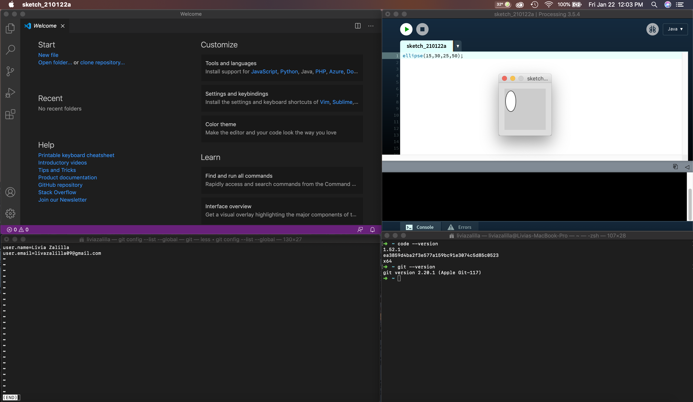
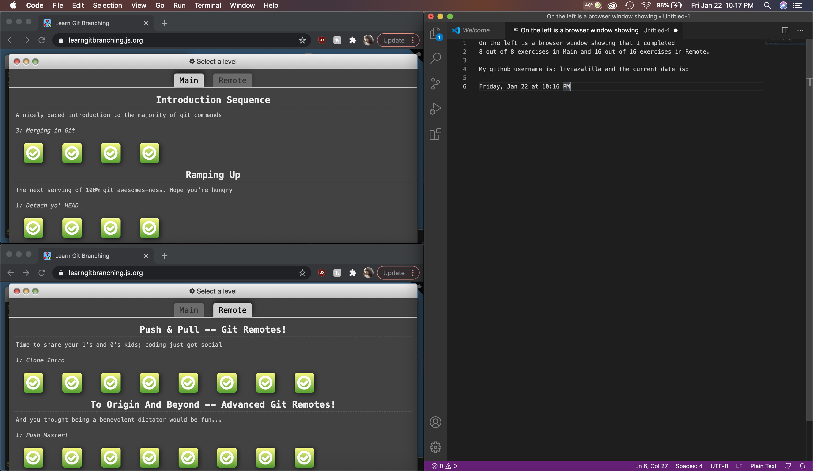

# Lab 1

**Task 1: Install Processing**

I installed the Processing Development Environment (PDE) on macOS.

**Task 2: Prepare your System** 

This is a screenshot that includes:
- One terminal window with the output of git config --list --global
- Another terminal window with the output of code --version and git --version sequentially printed
- Processing open with the following code run: ellipse(15,30,25,50);
- If you have not yet installed Processing, you should now go back and complete Task 1
- VS Code open
- Date/time should be visible somewhere in the screenshot

**Task 3: GitHub Tutorial**

This is a screenshot that includes:
- Both the exercises in “Main” and “Remotes”
- Text file where you write your github username and the current date/time

